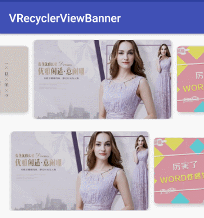

[  ](https://bintray.com/vegen/VRecyclerViewBanner/VRecyclerViewBanner/_latestVersion)

## 使用

```
implementation 'com.vegen.open:VRecyclerViewBanner:+'
```
`其中 '+' 请填写版本号 Download 后的最新版本`

## 示例(kotlin)

```
<com.vegen.open.library.VRecyclerViewBanner
        android:id="@+id/banner_type1"
        android:layout_width="match_parent"
        android:layout_height="140dp"
        android:layout_marginTop="10dp"
        android:layout_marginBottom="10dp"
        app:centerScale="1.2"
        app:itemSpace="10"
        app:autoPlaying="true"
        app:showIndicator="false">
</com.vegen.open.library.VRecyclerViewBanner>
```

```
var bannerDataList = arrayListOf(
                "https://ss0.bdstatic.com/70cFvHSh_Q1YnxGkpoWK1HF6hhy/it/u=1836951760,4163997228&fm=27&gp=0.jpg",
                "https://ss1.bdstatic.com/70cFuXSh_Q1YnxGkpoWK1HF6hhy/it/u=4266268942,741349847&fm=27&gp=0.jpg",
                "https://ss2.bdstatic.com/70cFvnSh_Q1YnxGkpoWK1HF6hhy/it/u=3776651069,3057832255&fm=26&gp=0.jpg"
        )
        
var adapter = HomeBannerAdapter(bannerDataList)
banner_type1.setAdapter(adapter)
```

轮播样式的 Adapter
```
class HomeBannerAdapter(var bannerList: ArrayList<String>) : RecyclerView.Adapter<HomeBannerAdapter.ViewHolder>() {

    private var onBannerItemClickListener: VRecyclerViewBanner.OnBannerItemClickListener? = null

    override fun onBindViewHolder(p0: ViewHolder, p1: Int) {
        var imgUrl = bannerList[p1]
        Glide.with(p0.ivBg.context).load(imgUrl).into(p0.ivBg)
        p0.itemView.setOnClickListener {
            onBannerItemClickListener?.onItemClick(p1)
        }
    }

    override fun onCreateViewHolder(p0: ViewGroup, p1: Int): ViewHolder {
        val view = LayoutInflater.from(p0.context).inflate(R.layout.item_home_bannner, p0, false)
        return ViewHolder(view)
    }

    override fun getItemCount(): Int {
        return bannerList?.size
    }

    fun setOnBannerItemClickListener(onBannerItemClickListener: VRecyclerViewBanner.OnBannerItemClickListener) {
        this.onBannerItemClickListener = onBannerItemClickListener
    }


    class ViewHolder(itemView: View) : RecyclerView.ViewHolder(itemView) {
        var ivBg: ImageView
        var tvName: TextView

        init {
            tvName = itemView.findViewById(R.id.tv_name)
            ivBg = itemView.findViewById(R.id.iv_bg)
        }
    }
}

```

demo 效果如下


## 相关属性

| **属性名称**  | **方法** | **意义** | **类型** | **默认值** |
| --- | ---| --- | --- | --- |
| app:showIndicator |setShowIndicator(boolean showIndicator)| 是否显示指示器 | boolean | false |
| app:interval |setAutoPlayDuration(int autoPlayDuration)| 轮播时间间隔 | int | 4000 |
| app:isAutoPlaying |setAutoPlaying(boolean isAutoPlaying)| 是否开启自动轮播 | boolean | true |
| app:orientation | setOrientation(int orientation)|轮播图方向 | enum | horizontal |
| app:itemSpace |setItemSpace(int itemSpace) |图片间距 | int | 20 |
| app:centerScale | setCenterScale(float centerScale)|当前图片缩放比列 | float | 1.2 |
| app:moveSpeed | setMoveSpeed(float moveSpeed)|滚动速度，越大越快 | float | 1.0 |
| app:showItemCount | setShowItemCount(int count)|可视范围内显示的个数 | enum | THREE |
| app:firstItemMarginLeft | setFirstItemMarginLeft(float marginLeft)|第一个 item 的左边距，showItemCount=TWO 时才生效的属性 | dimension | 0dp |


## 致谢
[RecyclerBanner](https://github.com/renjianan/RecyclerBanne) 参考了部分源码